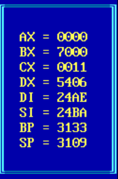

# Resident program

Прогрмма для вывода таблички с регистрами. Значения могут выводится как в режиме реального времени, так и в режиме замороженных значений ( в эту секнуду) . У таблицы есть тройная буферезация, поэтому она всегда выводится поверх других окон.

## Демонстрация

  

## 🚀 Запуск
* Запустите com файл, после чего должно вывести "SUCCESSFULLY INSTALLED" - значит программа запущена и готова к работе.

*  В репозиторие есть тестовая программа с помощью которой можно проверить корректность вывода регистров. Чтобы выполнить тест запустите test.com и далее откройте таблицу, не нажимая других клавишь. 

Таблица должна вывести:

|       Регистр    |     Значение      |
|------------------|-------------------|
|        AX        |       0011        |
|        BX        |       2222        |
|        CX        |       3333        |
|        DX        |       4444        |
|        DI        |       5555        |
|        SI        |       6666        |
|        BP        |       7777        |
|        SP        |       8888        |

После чего нажимаем любую клавишу и должно вывести:

|       Регистр    |     Значение      |
|------------------|-------------------|
|        AX        |       00FF        |
|        BX        |       EEEE        |
|        CX        |       DDDD        |
|        DX        |       CCCC        |
|        DI        |       BBBB        |
|        SI        |       AAAA        |
|        BP        |       9999        |
|        SP        |       0000        |

Eсли значения совпали, то всё правильно.

## ✨ Функционал

* При нажатии клавиши 6 - выводится таблица со значениями регистров, если таблица уже выведена, то наоборот такблица закроется. ( При закрывании рамки необходимо убрать мышку с рамки во избежание багов )
 
* При нажатии клавиши 7 - значеня регистров замораживаются в состоянии на момент нажатия, если показания уже заморожены то при нажатии программа вернятся в режим реального времени.

## ⚠️ Баги

Если в момент закрывания таблицы на ней будет мышка, то на заднем фоне могут появится символы, поэтому нужно убирать мышку с рамки при закрывании.
